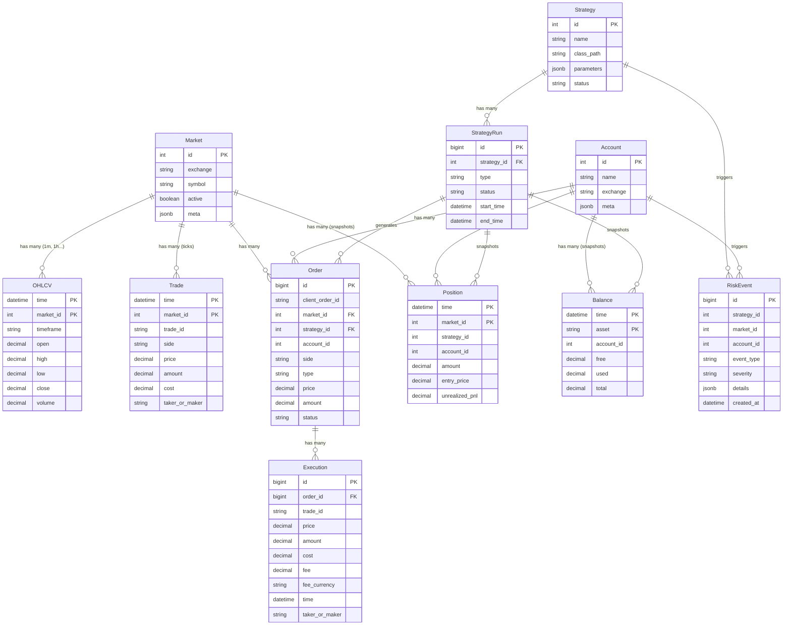

# 数据库模式设计 (Database Schema Design)

本文档详细描述了 Kurisu 交易系统的核心数据库模式设计。基于 PostgreSQL 和 TimescaleDB 构建，旨在高效存储和查询大规模时间序列市场数据。

## 1. 设计原则

- **时间序列优先**: 使用 TimescaleDB 的 Hypertable 特性优化 K 线 (OHLCV) 和 逐笔成交 (Trades) 数据。
- **高精度**: 价格和数量字段统一使用 `DECIMAL/NUMERIC` 类型，避免浮点数精度丢失。
- **规范化**: 基础元数据（如交易对信息）与高频时序数据分离，减少冗余。
- **异步支持**: 配合 `asyncpg` 驱动和 SQLAlchemy 异步 ORM。
- **查询友好**: 为回测与最新行情查询设置明确索引策略。
- **时区一致**: 所有时间字段统一使用 `TIMESTAMPTZ`。

## 2. 核心实体关系图 (ERD 概览)




## 3. 详细表结构定义

### 3.1 市场元数据表 (`markets`)

存储所有支持的交易对及其静态属性。

| 字段名 | 类型 | 约束 | 描述 |
| :--- | :--- | :--- | :--- |
| `id` | `Integer` | PK, AutoIncrement | 内部唯一标识符 |
| `exchange` | `String(50)` | Not Null, Index | 交易所名称 (e.g., 'binance') |
| `symbol` | `String(50)` | Not Null, Index | 统一交易对符号 (e.g., 'BTC/USDT') |
| `base_asset` | `String(20)` | Not Null | 基础资产 (e.g., 'BTC') |
| `quote_asset` | `String(20)` | Not Null | 报价资产 (e.g., 'USDT') |
| `active` | `Boolean` | Default True | 是否启用该交易对 |
| `meta` | `JSONB` | Default {} | 交易所特定的元数据 (精度、最小下单量等) |
| `exchange_symbol` | `String(50)` | Nullable | 交易所原始交易对符号 |
| `price_precision` | `Integer` | Nullable | 价格精度 |
| `amount_precision` | `Integer` | Nullable | 数量精度 |

**唯一约束**: `(exchange, symbol)` 必须唯一。

### 3.2 K 线数据表 (`ohlcv`)

存储历史和实时的 K 线数据。这将是一个 **TimescaleDB Hypertable**。

| 字段名 | 类型 | 约束 | 描述 |
| :--- | :--- | :--- | :--- |
| `time` | `DateTime(TIMESTAMPTZ)` | PK | K 线开始时间 |
| `market_id` | `Integer` | PK, FK(`markets.id`) | 关联的市场 ID |
| `timeframe` | `String(10)` | PK | 时间周期 (e.g., '1m', '1h', '1d') |
| `open` | `Numeric(20,10)` | Not Null | 开盘价 |
| `high` | `Numeric(20,10)` | Not Null | 最高价 |
| `low` | `Numeric(20,10)` | Not Null | 最低价 |
| `close` | `Numeric(20,10)` | Not Null | 收盘价 |
| `volume` | `Numeric(20,10)` | Not Null | 成交量 |

**分区策略**:
- 按 `time` 字段进行时间分区 (Chunk)。
- 建议配置 TimescaleDB 压缩，按 `(market_id, timeframe)` 分组，按 `time` 排序。

**索引建议**:
- `idx_ohlcv_market_timeframe_time_desc` on (`market_id`, `timeframe`, `time DESC`)
- `idx_ohlcv_market_time_desc` on (`market_id`, `time DESC`)

**Timeframe 约定**:
- 允许值示例：`1m`, `5m`, `15m`, `1h`, `4h`, `1d`。

### 3.3 逐笔成交表 (`trades`)

如果需要回测高频策略，可存储原始成交流。

| 字段名 | 类型 | 约束 | 描述 |
| :--- | :--- | :--- | :--- |
| `time` | `DateTime(TIMESTAMPTZ)` | PK | 成交时间 |
| `market_id` | `Integer` | PK, FK | 关联市场 |
| `trade_id` | `String` | Not Null | 交易所原始成交 ID |
| `side` | `String(4)` | | 'buy' or 'sell' |
| `price` | `Numeric(20,10)` | | 成交价 |
| `amount` | `Numeric(20,10)` | | 成交数量 |
| `cost` | `Numeric(20,10)` | | 成交额 (price * amount) |
| `taker_or_maker` | `String(5)` | | 'taker' or 'maker' |

**索引建议**:
- `idx_trades_market_time_desc` on (`market_id`, `time DESC`)

**约束建议**:
- `unique_trades_market_trade_id` on (`market_id`, `trade_id`)

**TimescaleDB 建议**:
- 如果逐笔成交写入频率高，建议将 `trades` 转为 Hypertable，并配置压缩与保留策略。

**迁移脚本示例**:
```sql
SELECT create_hypertable('trades', 'time', if_not_exists => TRUE);

ALTER TABLE trades SET (
    timescaledb.compress,
    timescaledb.compress_segmentby = 'market_id',
    timescaledb.compress_orderby = 'time DESC'
);

SELECT add_compression_policy('trades', INTERVAL '3 days');

SELECT add_retention_policy('trades', INTERVAL '30 days');
```


### 3.4 订单管理表 (`orders`)

记录系统发出的所有订单及其状态变更。

| 字段名 | 类型 | 约束 | 描述 |
| :--- | :--- | :--- | :--- |
| `id` | `BigInt` | PK, AutoIncrement | 内部订单 ID |
| `client_order_id` | `String(50)` | Unique Index | 客户端自定义 ID |
| `exchange_order_id` | `String` | Index | 交易所返回的订单 ID |
| `market_id` | `Integer` | FK | 关联市场 |
| `strategy_id` | `Integer` | FK | 关联策略 (Optional) |
| `account_id` | `Integer` | FK(`accounts.id`), Index | 账户标识 (Optional) |
| `side` | `String(4)` | | 'buy' or 'sell' |
| `type` | `String(10)` | | 'limit', 'market', etc. |
| `price` | `Numeric(20,10)` | | 委托价格 (限价单) |
| `amount` | `Numeric(20,10)` | | 委托数量 |
| `filled` | `Numeric(20,10)` | Default 0 | 已成交数量 |
| `remaining` | `Numeric(20,10)` | | 剩余数量 |
| `cost` | `Numeric(20,10)` | Default 0 | 累计成交额 |
| `status` | `String(20)` | Index | 'open', 'closed', 'canceled', 'failed' |
| `created_at` | `DateTime(TIMESTAMPTZ)` | Index | 创建时间 |
| `updated_at` | `DateTime(TIMESTAMPTZ)` | | 更新时间 |

### 3.5 成交明细表 (`executions`)

记录订单的具体成交情况（一个订单可能分多次成交）。

| 字段名 | 类型 | 约束 | 描述 |
| :--- | :--- | :--- | :--- |
| `id` | `BigInt` | PK, AutoIncrement | 内部成交 ID |
| `order_id` | `BigInt` | FK(`orders.id`) | 关联内部订单 ID |
| `trade_id` | `String` | | 交易所成交 ID |
| `price` | `Numeric(20,10)` | | 成交价格 |
| `amount` | `Numeric(20,10)` | | 成交数量 |
| `cost` | `Numeric(20,10)` | | 成交额 |
| `fee` | `Numeric(20,10)` | | 手续费 |
| `fee_currency` | `String(10)` | | 手续费币种 |
| `time` | `DateTime(TIMESTAMPTZ)` | Index | 成交时间 |
| `taker_or_maker` | `String(5)` | | 'taker' or 'maker' |

**约束建议**:
- `unique_executions_order_trade_id` on (`order_id`, `trade_id`)

### 3.6 持仓快照表 (`positions`)

记录策略持仓状态。

| 字段名 | 类型 | 约束 | 描述 |
| :--- | :--- | :--- | :--- |
| `time` | `DateTime(TIMESTAMPTZ)` | PK | 快照时间 |
| `market_id` | `Integer` | PK, FK | 关联市场 |
| `strategy_id` | `Integer` | FK | 关联策略 (Optional) |
| `account_id` | `Integer` | FK(`accounts.id`), Index | 账户标识 (Optional) |
| `amount` | `Numeric(20,10)` | | 持仓数量 (正数多头, 负数空头) |
| `entry_price` | `Numeric(20,10)` | | 平均开仓价 |
| `unrealized_pnl` | `Numeric(20,10)` | | 未实现盈亏 |

### 3.7 账户余额表 (`balances`)

记录账户资金变化快照。

| 字段名 | 类型 | 约束 | 描述 |
| :--- | :--- | :--- | :--- |
| `time` | `DateTime(TIMESTAMPTZ)` | PK | 快照时间 |
| `asset` | `String(20)` | PK | 资产名称 (e.g. 'USDT') |
| `account_id` | `Integer` | FK(`accounts.id`), Index | 账户标识 (Optional) |
| `free` | `Numeric(20,10)` | | 可用余额 |
| `used` | `Numeric(20,10)` | | 冻结余额 (挂单中) |
| `total` | `Numeric(20,10)` | | 总余额 |

### 3.8 账户表 (`accounts`)

记录账户信息，用于区分多账户与交易所连接。

| 字段名 | 类型 | 约束 | 描述 |
| :--- | :--- | :--- | :--- |
| `id` | `Integer` | PK, AutoIncrement | 账户 ID |
| `name` | `String(50)` | Not Null | 账户名称 |
| `exchange` | `String(50)` | Not Null | 交易所名称 |
| `meta` | `JSONB` | Default {} | 账户元信息 |

**唯一约束**: `(exchange, name)` 必须唯一。

### 3.9 策略管理表 (`strategies`)

存储策略定义与参数配置。

| 字段名 | 类型 | 约束 | 描述 |
| :--- | :--- | :--- | :--- |
| `id` | `Integer` | PK, AutoIncrement | 策略 ID |
| `name` | `String(100)` | Unique | 策略名称 |
| `description` | `Text` | | 策略描述 |
| `class_path` | `String` | Not Null | 策略类路径 (e.g. `strategies.grid.GridStrategy`) |
| `parameters` | `JSONB` | Default {} | 默认参数 |
| `status` | `String(20)` | Default 'active' | 状态 (active/paused/archived) |
| `created_at` | `DateTime(TIMESTAMPTZ)` | | 创建时间 |
| `updated_at` | `DateTime(TIMESTAMPTZ)` | | 更新时间 |

### 3.10 策略运行实例表 (`strategy_runs`)

记录每次策略启动的运行实例（Backtest 或 Live）。

| 字段名 | 类型 | 约束 | 描述 |
| :--- | :--- | :--- | :--- |
| `id` | `BigInt` | PK, AutoIncrement | 运行实例 ID |
| `strategy_id` | `Integer` | FK | 关联策略 |
| `type` | `String(20)` | | 'backtest' or 'live' |
| `status` | `String(20)` | | 'running', 'completed', 'failed' |
| `start_time` | `DateTime(TIMESTAMPTZ)` | | 开始时间 |
| `end_time` | `DateTime(TIMESTAMPTZ)` | | 结束时间 |
| `parameters` | `JSONB` | | 运行时参数快照 |
| `metrics` | `JSONB` | | 运行结果指标 (ROI, Sharpe, etc.) |

### 3.11 风控事件表 (`risk_events`)

记录风控触发事件。

| 字段名 | 类型 | 约束 | 描述 |
| :--- | :--- | :--- | :--- |
| `id` | `BigInt` | PK, AutoIncrement | 事件 ID |
| `strategy_id` | `Integer` | FK | 关联策略 (Optional) |
| `market_id` | `Integer` | FK | 关联市场 (Optional) |
| `event_type` | `String(50)` | | 事件类型 (e.g. 'max_drawdown', 'high_exposure') |
| `severity` | `String(20)` | | 'info', 'warning', 'critical' |
| `details` | `JSONB` | | 事件详情 |
| `created_at` | `DateTime(TIMESTAMPTZ)` | Index | 触发时间 |

### 3.12 枚举与约束建议

- `ohlcv.timeframe`: `1m`, `5m`, `15m`, `1h`, `4h`, `1d`
- `orders.side`: `buy`, `sell`
- `orders.type`: `limit`, `market`, `stop_loss`, `take_profit`
- `orders.status`: `open`, `closed`, `canceled`, `failed`
- `executions.taker_or_maker` / `trades.taker_or_maker`: `taker`, `maker`
- `strategy_runs.type`: `backtest`, `live`
- `strategy_runs.status`: `running`, `completed`, `failed`

## 4. TimescaleDB 特定优化

### 4.1 前置要求

```sql
CREATE EXTENSION IF NOT EXISTS timescaledb;
```

在 Alembic 迁移脚本中，创建 `ohlcv` 表后，需要执行以下 SQL 将其转换为 Hypertable：

```sql
SELECT create_hypertable('ohlcv', 'time', if_not_exists => TRUE);

ALTER TABLE ohlcv SET (
    timescaledb.compress,
    timescaledb.compress_segmentby = 'market_id,timeframe',
    timescaledb.compress_orderby = 'time DESC'
);

SELECT add_compression_policy('ohlcv', INTERVAL '7 days');

SELECT add_retention_policy('ohlcv', INTERVAL '1 year');
```

### 4.2 连续聚合 (Continuous Aggregates)

为了优化多周期查询，建议仅存储 `1m` (分钟线) 数据，并利用 Continuous Aggregates 自动计算 `1h`, `4h`, `1d` 等周期。

**优点**:
- 节省存储空间 (无需存储重复数据)。
- 保证各周期数据一致性。
- 查询速度快 (预计算)。

**示例定义**:

```sql
CREATE MATERIALIZED VIEW ohlcv_1h
WITH (timescaledb.continuous) AS
SELECT time_bucket('1 hour', time) AS bucket,
       market_id,
       first(open, time) AS open,
       max(high) AS high,
       min(low) AS low,
       last(close, time) AS close,
       sum(volume) AS volume
FROM ohlcv
WHERE timeframe = '1m'
GROUP BY bucket, market_id;

SELECT add_continuous_aggregate_policy('ohlcv_1h',
    start_offset => INTERVAL '7 days',
    end_offset => INTERVAL '1 hour',
    schedule_interval => INTERVAL '10 minutes');
```


## 5. SQLAlchemy 模型实现预览

```python
from sqlalchemy import Column, Integer, String, Boolean, Numeric, DateTime, ForeignKey, UniqueConstraint, BigInteger, Text
from sqlalchemy.dialects.postgresql import JSONB
from sqlalchemy.orm import relationship
from app.core.database import Base

class Market(Base):
    __tablename__ = "markets"
    
    id = Column(Integer, primary_key=True, index=True)
    exchange = Column(String(50), nullable=False)
    symbol = Column(String(50), nullable=False)
    base_asset = Column(String(20), nullable=False)
    quote_asset = Column(String(20), nullable=False)
    active = Column(Boolean, default=True)
    meta = Column(JSONB, default={})
    exchange_symbol = Column(String(50))
    price_precision = Column(Integer)
    amount_precision = Column(Integer)
    
    orders = relationship("Order", back_populates="market")

    __table_args__ = (
        UniqueConstraint('exchange', 'symbol', name='uix_exchange_symbol'),
    )

class OHLCV(Base):
    __tablename__ = "ohlcv"
    
    time = Column(DateTime(timezone=True), primary_key=True)
    market_id = Column(Integer, ForeignKey("markets.id"), primary_key=True)
    timeframe = Column(String(10), primary_key=True)
    open = Column(Numeric(20, 10), nullable=False)
    high = Column(Numeric(20, 10), nullable=False)
    low = Column(Numeric(20, 10), nullable=False)
    close = Column(Numeric(20, 10), nullable=False)
    volume = Column(Numeric(20, 10), nullable=False)

class Trade(Base):
    __tablename__ = "trades"

    time = Column(DateTime(timezone=True), primary_key=True)
    market_id = Column(Integer, ForeignKey("markets.id"), primary_key=True)
    trade_id = Column(String, nullable=False)
    side = Column(String(4))
    price = Column(Numeric(20, 10))
    amount = Column(Numeric(20, 10))
    cost = Column(Numeric(20, 10))
    taker_or_maker = Column(String(5))

class Account(Base):
    __tablename__ = "accounts"
    
    id = Column(Integer, primary_key=True)
    name = Column(String(50), nullable=False)
    exchange = Column(String(50), nullable=False)
    meta = Column(JSONB, default={})
    
    orders = relationship("Order", back_populates="account")
    
    __table_args__ = (
        UniqueConstraint('exchange', 'name', name='uix_exchange_name'),
    )

class Order(Base):
    __tablename__ = "orders"
    
    id = Column(BigInteger, primary_key=True, index=True)
    client_order_id = Column(String(50), unique=True, index=True)
    exchange_order_id = Column(String, index=True)
    market_id = Column(Integer, ForeignKey("markets.id"))
    strategy_id = Column(Integer, ForeignKey("strategies.id"))
    account_id = Column(Integer, ForeignKey("accounts.id"), index=True)
    side = Column(String(4))
    type = Column(String(10))
    price = Column(Numeric(20, 10))
    amount = Column(Numeric(20, 10))
    filled = Column(Numeric(20, 10), default=0)
    remaining = Column(Numeric(20, 10))
    cost = Column(Numeric(20, 10), default=0)
    status = Column(String(20), index=True)
    created_at = Column(DateTime(timezone=True), index=True)
    updated_at = Column(DateTime(timezone=True))
    
    strategy = relationship("Strategy", back_populates="orders")
    account = relationship("Account", back_populates="orders")
    market = relationship("Market", back_populates="orders")
    executions = relationship("Execution", back_populates="order")

class Execution(Base):
    __tablename__ = "executions"
    
    id = Column(BigInteger, primary_key=True)
    order_id = Column(BigInteger, ForeignKey("orders.id"))
    trade_id = Column(String)
    price = Column(Numeric(20, 10), nullable=False)
    amount = Column(Numeric(20, 10), nullable=False)
    cost = Column(Numeric(20, 10))
    fee = Column(Numeric(20, 10))
    fee_currency = Column(String(10))
    time = Column(DateTime(timezone=True), index=True)
    taker_or_maker = Column(String(5))
    
    order = relationship("Order", back_populates="executions")

class Position(Base):
    __tablename__ = "positions"

    time = Column(DateTime(timezone=True), primary_key=True)
    market_id = Column(Integer, ForeignKey("markets.id"), primary_key=True)
    strategy_id = Column(Integer, ForeignKey("strategies.id"))
    account_id = Column(Integer, ForeignKey("accounts.id"), index=True)
    amount = Column(Numeric(20, 10))
    entry_price = Column(Numeric(20, 10))
    unrealized_pnl = Column(Numeric(20, 10))

class Balance(Base):
    __tablename__ = "balances"

    time = Column(DateTime(timezone=True), primary_key=True)
    asset = Column(String(20), primary_key=True)
    account_id = Column(Integer, ForeignKey("accounts.id"), index=True)
    free = Column(Numeric(20, 10))
    used = Column(Numeric(20, 10))
    total = Column(Numeric(20, 10))

class Strategy(Base):
    __tablename__ = "strategies"

    id = Column(Integer, primary_key=True)
    name = Column(String(100), unique=True, nullable=False)
    description = Column(Text)
    class_path = Column(String, nullable=False)
    parameters = Column(JSONB, default={})
    status = Column(String(20), default="active")
    created_at = Column(DateTime(timezone=True))
    updated_at = Column(DateTime(timezone=True))
    
    orders = relationship("Order", back_populates="strategy")

class StrategyRun(Base):
    __tablename__ = "strategy_runs"

    id = Column(BigInteger, primary_key=True)
    strategy_id = Column(Integer, ForeignKey("strategies.id"))
    type = Column(String(20))
    status = Column(String(20))
    start_time = Column(DateTime(timezone=True))
    end_time = Column(DateTime(timezone=True))
    parameters = Column(JSONB)
    metrics = Column(JSONB)

class RiskEvent(Base):
    __tablename__ = "risk_events"

    id = Column(BigInteger, primary_key=True)
    strategy_id = Column(Integer, ForeignKey("strategies.id"))
    market_id = Column(Integer, ForeignKey("markets.id"))
    account_id = Column(Integer, ForeignKey("accounts.id"))
    event_type = Column(String(50))
    severity = Column(String(20))
    details = Column(JSONB)
    created_at = Column(DateTime(timezone=True), index=True)
```


## 6. 迁移计划

1. **初始迁移**: 创建 `markets` 和 `ohlcv` 基础表结构。
2. **Hypertable 转换**: 在迁移脚本的 `upgrade()` 函数中执行 `create_hypertable`。
3. **索引补全**: 添加 OHLCV 查询常用索引。
4. **数据接入**: 编写脚本从 CCXT 获取数据填充 `markets` 表。
